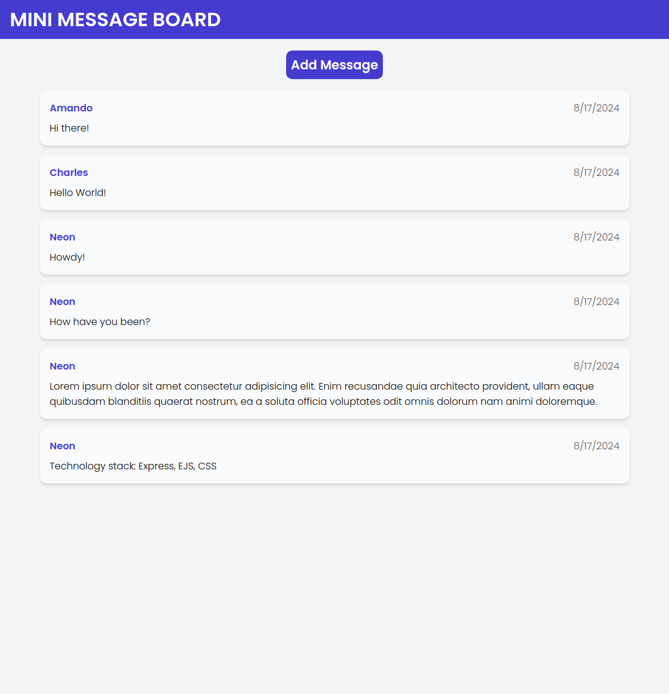
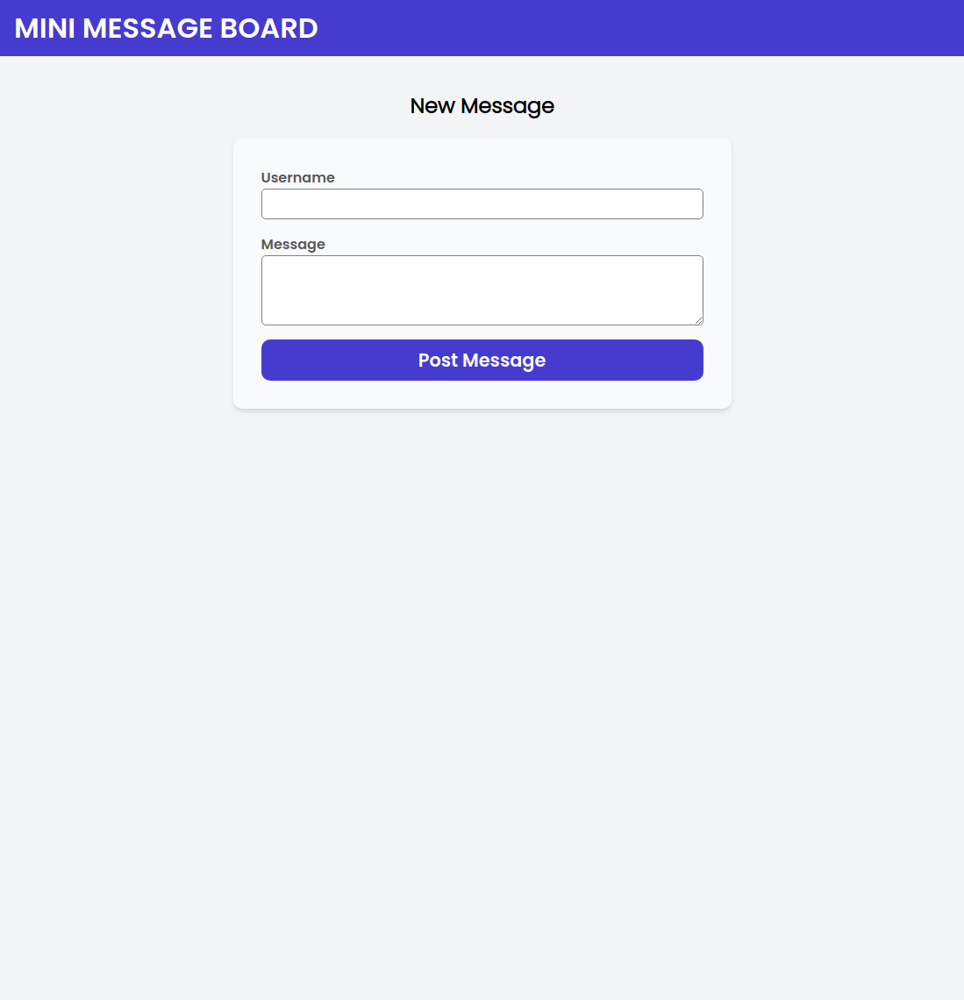
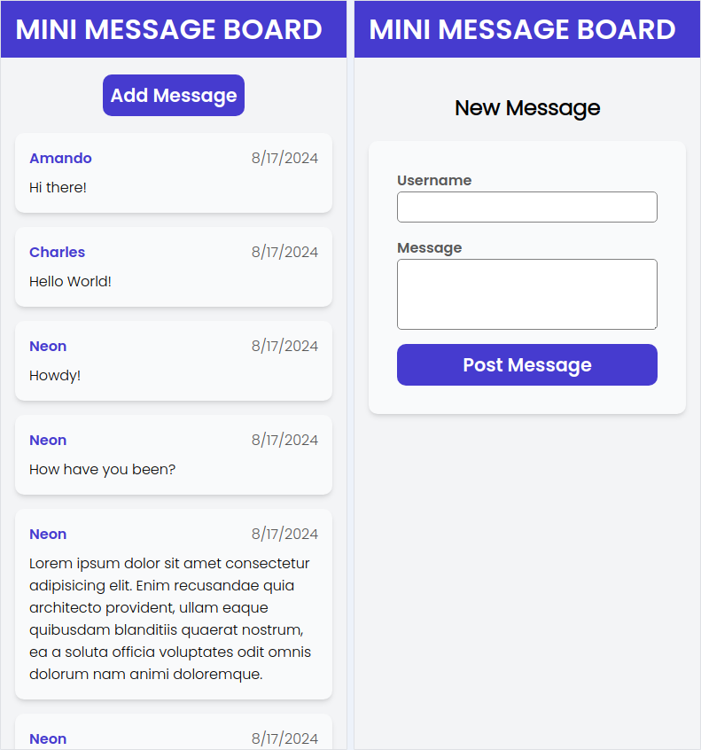

# Odin Project #23: Mini Message Board

The goal of this Odin Project assignment was to create a simple message board using Express, EJS and PostreSQL. The user can browse existing messages and add new ones to the database. Originally the project didn't use a real database and relied on a mock JS array instead, but the project was refactored to use PostreSQL.

I started and finished this project in August 2024.

## Assignment

[The Odin Project - NodeJS - #23 Part 1 Mini Message Board](https://www.theodinproject.com/lessons/node-path-nodejs-mini-message-board)

[The Odin Project - NodeJS - #23 Part 2 Using PostgreSQL](https://www.theodinproject.com/lessons/nodejs-using-postgresql#assignment)

## Technology

- JavaScript
- Node.js
- Express
- Express validator
- PostreSQL
- EJS
- CSS

## Key Concepts

- MVC: Model View Controller pattern
- Express: setting up an app, middleware functions
- Routes: Express Router, HTTP verbs, paths
- Controllers: response methods, middleware
- Views: EJS configuration, using JS inside templates, sharing components across templates, rendering a view in a controller callback, serving static assets
- PostreSQL: instalation, setting up a db, using node-postgres in Express (client & pool), queries
- Express validator: data validation, body() function, validationResult
- dotenv: env variables

## Screenshots





### Mobile



## Deployment

Requires setting up a PostreSQL database and adding its URL to the .env file. Instructions for Linux and macOS can be found [here on The Odin Project website](https://www.theodinproject.com/lessons/nodejs-installing-postgresql).

```bash
# clone repo
git clone https://github.com/BrightNeon7631/odin-mini-message-board.git

# add default data to the db
npm run seed

# start server
node app.js
```
